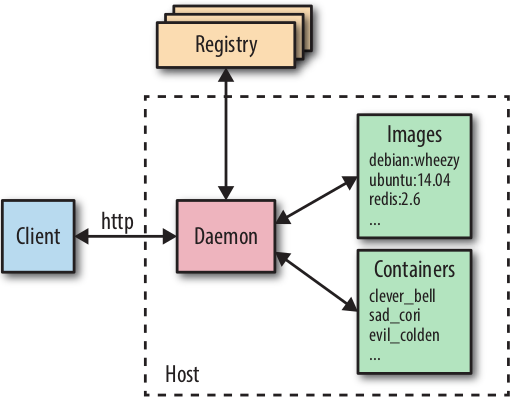

# Основы Docker

## Архитектура Docker

Чтобы понять как наиболее эффективно использовать Docker и некоторые не вполне
очевидные его свойства, необходимо хотя бы в целом представлять себе, каким образом организована совместная работа
компонентов платформы, скрытых от пользователя.



- в центре расположен демон Docker (Docker daemon), ответственный за создание, запуск и контроль
  работы контейнеров, а так же за создание и хранение образов. Контейнеры и образы представлены в 
  правой части диаграммы. Демон Docker запускается командой `docker daemon`, обычно об этом заботится
  ОС хоста;


- клиент Docker, размещенный в левой части диаграммы, используется для диалога с демоном Docker по 
  протоколу HTTP. По умолчанию это соединение устанавливается через сокет домена Unix, но также может
  использоваться TCP-сокет для поддержки соединений с удаленными клиентами или дискриптор файла для 
  сокетов, управляемый `systemd`. Так как все затруднения организовать соединене с удаленным демонами
  Docker и разработать привязки (bindings) к нужному языку программирования, но при этом следует учитывать
  особенности реализации этих возможностей, например обязательное наличие контекста создания
  (building context), описанного в соответствующем разделе данной книги. Интерфейсы прикладного 
  программирования, используемые для организации обмена данными с демоном, четко определены и 
  подробно документированы, что позволяет разработчиками писать программы, взаимодействующие 
  напрямую с демоном, без использования клиента Docker. Клиент и демон Docker распространяются 
  как отдельные независимые бинарные файлы;


- реестры Docker используют для хранения и расположения образов. Реестром, выбираемым по умолчанию, является 
  Docker Hub, на котором хранится тысячи общедоступных образов, а так же управляемые "официальные" образы.
  Многие организации создают собственные реестры, которые используются для хранения коммерческих и приватных 
  образов и для устранения накладных расходов, связанных с загрузкой образов через интернет. В разделе
  "Создание собственного реестра" содержится более подробная информация об организации и сопровождении
  нового частного реестра. Демон Docker загружает образы из реестров по запросу `docker pull`. Кроме того, 
  он выполняет автоматическую загрузку образов, указанных в запросе `docker run` и в инструкции `FROM` файла
  Dockerfile, если эти образы недоступны на локальной системе.

### Базовые технологии

Демон Docker использует "драйвер выполнения" (execution driver) для создания контейнеров. По умолчанию выбирается
собственный драйвер Docker `runc`, но, кроме того, обеспечивается поддержка более старого драйвера для 
механизма LXC. Драйвер `runc` очень тесно связан со следующими механизмами ядра:
- `cgroups` - механизм, отвечающий за управление ресурсами, используемыми контейнером (процессор, ОЗУ и тд).
Механизм `cgroups` так же обеспечивает выполнение операции замораживания контейнеров как поддержку функциональности
команды `docker pause`;


- `пространство имен (namespaces)` отвечают за изоляцию контейнеров, гарантируют что файловая система, имя хоста, 
пользователи, сетевая среда и процессы любого контейнера полностью отделены от остальной части системы.


`Libcontainer` также поддерживает `SElinux` и `AppArmor`, которые можно использовать для создания
более строгой системы безопасности. 

Еще одной основополагающей технологией для Docker является файловая система с каскадно-объединенным монтированием
(Union File System - UnionFS), обеспечивающая хранение уровней для контейнеров. Функциональность UnionFS
обеспечивается одним из нескольких драйверов файловой системы: `AUFS`, `devicemapper`, `BTRFS` или `Overlay`.

### Сопровождающие технологии

Сами по себе механизмы Docker и реестр Docker Hub не представляют завершенного полноценного решения
для работы с контейнерами. Для большинства пользователей потребуются сервисы поддержки и вспомогательное ПО,
например система управления кластерами, инструменты обнаружения сервисов, расширенные сетевые функциональные 
возможности и проч. Docker Inc. планирует создания полноценного решения "из коробки", включающего все требуемые
возможности, но позволяющего пользователям без труда заменять компоненты, установленные по умолчанию, на компоненты
сторонних производителей. Стратегия "заменяемых батареек" в первую очередь реализуется на уровне интерфейсов 
прикладного программирования, позволяя подключать компоненты непосредственно к движку Docker, но её так же можно
наблюдать на формировании дистрибутивных пакетов Docker как независимых автономных бинарных файлов, которые с легкостью
заменяются аналогами от третьих сторон.


На текущий момент можно привести следующий список технологий поддержи, предоставляемых Docker:
- `Swarm` - решение задачи кластеризации от Docker. `Swarm` позволяет сгруппировать несколько Docker-хостов,
после чего пользователь может работать с этой группой как с единым ресурсом.


- `Docker Compose` - инструмент для создания и выполнения приложений, скомпонованных из нескольких
Docker-контейнеров. Такие компоновки используются главным образом при разработке и тестировании, но 
гораздо реже в производственной среде. 


- `Docker Maсhine` - устанавливает и конфигурирует Docker-хосты на локальных и удаленных ресурсах. Кроме того, 
Maсhine конфигурирует клиента Docker, упрощая процедуру переключения между средами.


`Kitematic` представляет собой графический пользовательский интерфейс для Mac OS и Windows, обеспечивающий 
запуск и управление контейнеров Docker.

`Docker Trusted Registry` - локально устанавливаемое программное решение для хранения и управления образами
Docker Hub, которую можно объединить с существующей инфраструктурой обеспечения безопасности и согласовать
с правилами хранения и обеспечения защиты данных, принятых в конкретной организации. Все функциональные
возможности локального реестра, в том числе различные метрики, управление доступом на основе ролей и 
регистрационные журналы, контролируются через административную консоль. В настоящий момент это единиственный
программный продукт Docker Inc., исходный код которого закрыт.

Список сервисов и приложений третьих сторон, которые основаны на Docker или используют эту платформу, уже 
сейчас достаточно велик. Некоторые полноценные решения доступны в следующих областях:

- `сетевая среда` - создание сетей контейнеров, распределенных между разными хостами, представляет собой
непростую задачу, которую можно решить разнообразными способами. Недавно в этой области появилось
несколько решений, например [Weave](http://weave.works/net/) и [Project Calico](http://www.projectcalico.org/).
Кроме того, Docker намерен в ближайшем будущем представить комплексно сетевое решение под названием Overlay.
Пользователи смогут заменить драйвер Overlay на любые другие решения, использую подключаемую программную
рабочую среду для работы в сети;


- `обнаружение сервисов` - сразу после появления контейнеров Docker потребовался способ поиска других 
сервисов для взаимодействия с ним. Обычно такие сервисы также работают в контейнерах. Поскольку IP-адреса
присваиваются контейнерам динамически, задача обнаружения сервисов в больших системах достаточно 
сложна. К решениям в этой области относятся [Consul](https://consul.io/), [Registrator](https://github.com/gliderlabs/registrator)
, [SkyDNS](https://github.com/skynetservices/skydns/) и [etcd](https://github.com/coreos/etcd);


- `орекстровка и управление кластером` - при развертывании большого количества контейнеров весьма важно
наличие инструментов для контроля и управления всех системой в целом. Каждый новый контейнер должен быть
размещен на некотором хосте, его нужно контролировать и обновлять. Система должна правильно реагировать
на сбои или изменения нагрузки, перемещая, запуск или останавливая контейнеры соответствующим образом.
Здесь можно отметить несколько конкурирующих решений: [Kubernetes](http://kubernetes.io) от Google,
[Marathon](https://github.com/me-sosphere/marathon); фреймворк для [Mesos](https://mesos.apache.org),
[Fleet](https://github.com/coreos/fleet) от CoreOS, а также собственный инструмент Docker Swarm.

В дополнении к выше упомянутым подключаемым сетевым драйверам Docker поддерживает еще и _подключаемые тома_
_(volume plugins)_ для интеграции с другими системами хранения данных. Здесь особого внимания заслуживает
[Flocker](https://github.com/ClusterHQ/flocker), инструмент для управления данными и их перемещения 
в многохостовой системе, и [GlusterFS](https://github.com/calavera/docker-volume-glusterfs) для 
распределенного хранения данных. Более подробную информацию о фреймворке подключаемых драйверов
можно найти на [сайте](https://docs.docker.com/extend/plugins/).

Широкое распространение контейнеров привело к любопытному побочному эффекту, заключающемуся в появлении
нового поколения ОС, специализированных для поддержки контейнеров. Несмотря на то что Docker успешно
работает на большинстве современных дистрибутивов Linux, таких как Ubuntu, Red Hat и других, появились
проекты, направленные на создание облегченных и простых в сопровождении дистрибутивов, главной задачей
которых является только обеспечение работы контейнеров (или контейнеров и виртуальных машин), что особенно
важно для расширения функциональных возможностей центра обработки данных или кластера. В качестве примеров
можно привести [Project Atomic](http://www.projectatomic.io/), [CoreOS](https://coreos.com/), [RancherOS](http://rancher.com/rancher-os/).

### Хостинг для Docker

Многие известные облачные драйвера, в том числе Amazon, Google и Digital Ocean, уже предлагают определенный 
уровень поддержки Docker. Google Container Engine, возможно, является самым интересным вариантом, так как
создан непосредственно на платформе Kubernetes. Разумеется, даже если облачный провайдер не предлагает
прямую поддержку Docker, обычно имеет возможность представления виртуальных машин, в которых можно 
запускать Docker-контейнеры.

В этой области так же работает компания Joyent, предлагающая собственный механизм контейнеров под названием
Triton на основе SmartOS. С помощью реализации интерфейсов прикладного программирования Docker в своем механизме
контейнеров и технологии эмуляции Linux компания Joyent смогла создать общедоступный облачный сервис,
взаимодействующий со стандартным Docker клиентом. Более того, компания Joyent уверена, что ее реализация 
контейнера обладает высоким уровнем безопасности, позволяющим работать непосредственно с аппаратным обеспечением,
без необходимости размещения в виртуальной машине, а это может означать более высокую эффективность и существенное
сокращение накладных расходов, особенно с точки зрения операций ввода/вывода. 

Есть еще несколько проектов, организовавших PaaS-платформу на основе Docker, - [Deis](http://paz.sh), [Flynn](http://paz.sh) и [Paz](http://paz.sh)

## Как создаются образы

В этом разделе будет более подробно описано все происходящее при создании образа, а в конце
раздела приведено краткое руководство по различным инструкциям, используемым в Dockerfile. Всегда 
полезно понимать внутреннее функционирование команды создания, так как ее поведение иногда может 
становиться неожиданным.

### Контекст создания образа

Для команды `docker build` необходим Dockerfile и _контекст создания образа (build context)_ который может
быть пустым. 

Контекст создания - это набор локальных файлов и каталогов, к которым можно обращаться из инструкций
`ADD` и\или `COPY` в Dockerfile и которые обычно определяются как путь к нужному каталогу. Например,
команда создания образа `docker build -t test\cowsay-dockerfile .`, которая определяла контекст создания
как `.`, то есть текущий рабочий каталог. Все файлы и каталоги, расположенные по указанному пути, формируют
контекст создания образа и передаются в демон Docker как часть процесса создания.

В тех случаях, когда контекст не определен, - если задан только URL для Dockerfile или содержимое 
Dockerfile переедается по программному каналу из стандартного потока `STDIN`, - контекст создания данного
образа считается пустым.

> **Не следует использовать / в качастве контекста создания образа**
> 
> Поскольку контекст создания образа полностью включает tar-архив и передается в демон Docker, 
> не используйте для этой цели каталога, в котором содержится большое кол-во файлов. Например,
> если для контекста создания вы возьмете /home/user, Загрузки (Downloads) или /, то в результате
> получите длинную задержку, пока Docker-клиент будет упаковывать все файлы заданного каталога 
> и передавать их в демон.

Если задан URL, начинающийся с http или https, то предполагается, что это прямая ссылка на Dockerfile.
Маловероятно, что это окажется полезным, так как с файлом Dockerfile не связан какой-либо контекст
(а ссылки на архивы неприемлемы).

В качестве контекста создания образа разрешается указывать git-репозиторий. В этом случае клиент Docker
создаст клон такого репозитория и всех подчиненных модулей во временном каталоге, который затем 
передается в демон Docker как контекст создания образа. Docker воспринимает контекст как git-репозиторий,
если переданный путь начинается с префиксов `github.com/`, `git@` или `git://`. Вообще говоря, я рекомендую
избегать применения такого метода, вместо этого лучше перечислять репозиторий вручную - это более гибкий способ,
снижающий вероятность возникновения беспорядка.

Кроме того, клиент Docker способен принимать входные данные из стандартного потока ввода `STDIN`, если 
в команде указан аргумент `-` вместо контекста создания образа. Входными данными может быть либо 
Dockerfile без контекста (например,<br/> `docker build - < Dockerfile`), либо архивный файл, содержащий 
контекст, в том числе и Dockerfile (например,<br/>`docker build - < context.tar.gz`). Архивные файлы могут
передаваться в формате `tar.gz`, `xz`, или `bzip2`.

Размещение файла Dockerfile внутри контекста может быть указано с помощью аргумента `-f`
(например,<br/>`docker build -f dockerfile/Dockerfile.debug .`) Если нет прямого указания, то Docker попытается
найти файл с именем Dockerfile в корневом каталоге контекста.

> **Использование файла .dockeringnore**
> 
> Для удаления ненужных файлов из контекста создания образа можно воспользоваться файлом `.dockerignore`.
> Этот файл должен содержать имена исключаемых файлов, разделенных символами перехода на новую строку.
> Допускаются символы шаблнов `*` и `?.`. Например, можно сформировать `.dockerignore` со следующим содержимым:
> 
> `.git` `1`<br/>
> `*/.git` `2`<br/>
> `*/*/.git` `3`<br/>
> `*.sw?` `4`<br/>
> 
> `1` Из контекста исключается файл или каталог .git в корневом каталоге контекста создания образа, но при этом
> в контекст включается такой файл в любом подкаталоге (таким образом `.git` исключается, но `dir1/.git1` включается).<br/>
> `2` Из контекста исключается файл или каталог `.git`, расположенный в подкаталоге одним уровнем ниже корневого
> каталога (таким образом `dir1/dir2/.git` исключается, но `.git` и `dir1/dir2/.git` включаются).<br/>
> `3` Из контекста исключается файл или каталог `.git`, расположенный в подкаталоге двумя уровнями ниже корневого
> каталога (таким образом `dir1/dir2/.git` исключается, но, `.git` и `dir1/.git` включаются).<br/>
> `4` Из контекста исключаются файлы `test.swp`, `test.swo`, и `bla.swp`, но в контексте остается файл `dir1/test.swp`.

Не поддерживаются более сложные регулярные выражения, такие как `[A-Z]*`.

### Уровни образа

Способ создания образов Docker часто ставит в тупик неопытных пользователей. Каждая инструкция в Dockerfile
приводи к появлению нового _уровня (layer)_ образа, который также может участвовать в запуске контейнера.<br>
Новый уровень создается во время запуска контейнера с использованием образа предыдущего уровня при выполнении 
соответствующих инструкций Dockerfile и с сохранением нового образа. После успешного завершения выполнения 
инструкции Dockerfile вспомогательный контейнер удаляется, если в команде не был задан аргумент `--rm=false`.<br/>
Так как результатом выполнения каждой инструкции является создание статического образа - в сущности, это файловая
система и некоторые метаданные, - все активные процессы в данной инструкции будут завершены. Поэтому, несмотря на 
возможность инициализации в инструкции `RUN` долговременных процессов, подобных демонам СУБД и SSH, любые 
активные процессы прекратят свою работу при обработке следующей инструкции или запуске контейнера.<br/>
Если необходим сервис или процесс, запускаемый вместе с контейнером, его следует инициализировать с помощью
инструкции `ENTRYPOINT` или `CMD`.<br/>

Весь набор уровней, формирующих образ, можно увидеть, выполнив команду `docker history`:

```shell
$ docker history symfony_nginx
IMAGE          CREATED       CREATED BY                                      SIZE      COMMENT
d33cb3de286f   7 days ago    /bin/sh -c #(nop)  CMD ["nginx" "-g" "daemon…   0B        
d52d39e9f543   7 days ago    /bin/sh -c #(nop) WORKDIR /var/www/symfony      0B        
669e407cd748   7 days ago    /bin/sh -c #(nop)  EXPOSE 443                   0B        
fb0cb47e52c1   7 days ago    /bin/sh -c #(nop)  EXPOSE 80                    0B        
bc66d874522b   7 days ago    |6 DEBIAN_FRONTEND=noninteractive PAGESPEED_…   329kB     
30882c991da0   7 days ago    |6 DEBIAN_FRONTEND=noninteractive PAGESPEED_…   0B        
49f67db82b0e   7 days ago    |6 DEBIAN_FRONTEND=noninteractive PAGESPEED_…   323MB     
a55cc3f932bd   7 days ago    |6 DEBIAN_FRONTEND=noninteractive PAGESPEED_…   138MB     
3651fb2295a1   7 days ago    |6 DEBIAN_FRONTEND=noninteractive PAGESPEED_…   244MB     
42594e93909b   7 days ago    /bin/sh -c #(nop)  ARG RESTY_CONFIG_OPTIONS=…   0B        
a48457608ae2   7 days ago    /bin/sh -c #(nop) COPY file:eebef832a2c8b81b…   193B      
e197c0b79f13   7 days ago    /bin/sh -c #(nop)  ARG TERM=xterm-color         0B        
fd05bb596cad   7 days ago    /bin/sh -c #(nop)  ARG DEBIAN_FRONTEND=nonin…   0B        
42a8a0bce0b4   7 days ago    /bin/sh -c #(nop)  ARG PAGESPEED_VERSION=1.1…   0B        
49eb2c8d3e89   7 days ago    /bin/sh -c #(nop)  ARG RESTY_OPENSSL_VERSION…   0B        
d2473112a6cc   7 days ago    /bin/sh -c #(nop)  ARG RESTY_VERSION=1.13.6.2   0B        
5ddf6ebdcdb4   2 weeks ago   /bin/sh -c #(nop)  CMD ["bash"]                 0B        
<missing>      2 weeks ago   /bin/sh -c #(nop) ADD file:084c8b3d38d578aa3…   101MB  
```

Если создание образа завершилось неудачно, то может оказаться полезным запуск уровня, предшествующего ошибке.
Например, имеется следующий Dockerfile:
```dockerfile
FROM busybox:latest

RUN echo "This should work"
RUN /bin/bash -c echo "This won't"
```

Попробуем создать образ:
```shell
$ docker build -t echotest .
Sending build context to Docker daemon  2.048kB
Step 1/3 : FROM busybox:latest
latest: Pulling from library/busybox
24fb2886d6f6: Pull complete 
Digest: sha256:f7ca5a32c10d51aeda3b4d01c61c6061f497893d7f6628b92f822f7117182a57
Status: Downloaded newer image for busybox:latest
 ---> 16ea53ea7c65
Step 2/3 : RUN echo "This should work"
 ---> Running in a05bf0a07ece
This should work
Removing intermediate container a05bf0a07ece <- удаляется временный контейнер
 ---> 4f782ec7415f
Step 3/3 : RUN /bin/bash -c echo "This won't"
 ---> Running in 2d72080a9026
/bin/sh: /bin/bash: not found
The command '/bin/sh -c /bin/bash -c echo "This won't"' returned a non-zero code: 127
```

Несмотря на то что в нашем примере причина возникновения критической ошибки вполне очевидна, можно запустить 
образ, созданный из последнего успешно сформированного уровня, для отладки ошибочной инструкции. Обратите 
внимание на использование для этой цели идентификатора последнего образа (4f782ec7415f), а не последнего контейнера
(2d72080a9026):

```shell
$ docker run -it 4f782ec7415f
/ # /bin/bash -c "echo hmm"
sh: /bin/bash: not found
/ # /bin/sh -c "echo ahh!"
ahh!
/ # exit
```

Проблема становится гораздо более понятной: в образ busybox не включена командная оболочка `bash`.

### Кэширование

Для ускорения создания образов Docker выполняет кэширование каждого уровня. Кэширование очень важно
для повышения эффективности рабочих операций, но не всего его применение имеет смысл. Кэширование 
используется для инструкций при следующих условиях:

- в кэше была обнаружена предыдущая инструкция;
- в кэше имеется уровень, который имеет в точности ту же инструкцию и предшествующий родительский уровень
  (даже случайные пропуски могут сделать кэш некорректным).

Кроме того, для инструкций `COPY` и `ADD` кэш считается некорректным, если изменилась контрольная сумма или 
метаданные любого файла.<br/>
Это означает, что для сохраняемых в кэше инструкций `RUN` не гарантируется получение одинакового результата
при многократных повторных вызовах этих инструкций. Будьте особо внимательны, используя вызовы из кэша
для загрузки файлов, выполнения команды `apt-get update` и/или клонирование репозиториев исходного кода.

Чтобы запретить кэширование, можно выполнить команду `docker build` с аргументом `--no-cache`. Также 
можно добавить или заменить инструкцию перед строкой, в которой необходимо запретить кэширование, поэтому
иногда в файле Dockerfile встречаются строки, подобные следующей:
```dockerfile
ENV UPDATED_ON "14:12 17 February 2021"
RUN git clone...
```

Я не рекомендую применять такой способ, так как он может привести в полное замешательство всех, кто будет
в дальнейшем использовать данный образ, особенно если дата создания образа отличается от указанной в 
вышеприведенной строке Dockerfile.

### Базовые образы

При создании собственных образов необходимо выбрать один из базовых образов в качестве отправного пункта.
Выбор велик, поэтому стоит уделить время на изучение разнообразных достоинств и недостатков каждого базового
образа.<br/>

В идеальном случае создание нового образа вообще не потребуется - можно просто использовать существующий 
образ, объединив с ним свои конфигурационные файлы и/или данные. Во многих случаях такой подход применим 
для широко распространенного прикладного ПО, например для СУБД и веб-серверов, для которых доступны
готовые официальные образы. Вообще говоря, гораздо лучше воспользоваться официальным образом, чем пытаться
сформировать собственный - вам предлагается успешный результат работы людей, которые обладают солидным 
опытом организации работы ПО внутри контейнеров. Если официальный образ не подходит для вашей работы 
по некоторой конкретной причине, то попробуйте сформулировать эту причину как тему для обсуждения 
в исходном проекте, и наверняка найдутся пользователи, встречавшиеся с подобными проблемами и знающие, 
как их решить.<br/>

Если нужен образ для управления приложением, написанным вами, сначала попытайтесь поискать официальный
базовый образ для используемого языка или программной среды (например, Go или Ruby On Rails). Достаточно
часто можно воспользоваться различными образами для сборки и для распространения собственного ПО (например
для компиляции и сборки Java-приложения можно воспользоваться образом `java:jdk`, а распространять полученный
JAR-файл лучше с помощью более компактного образа `java:jre`, из которого исключены ненужные инструменты
компиляции и сборки). Некоторые другие официальные образы (такие как `node`) также представлены специализированными
компактными вариантами без инструментальных средств разработки и заголовочных файлов.<br/>

Иногда возникает потребность в использовании небольшого, но полноценного дистрибутива Linux. Если
действительно необходим предельный минимализм, рекомендуется обратить внимание на образ `alpine` размером
всего 5 Мб, при этом содержащий мощный менеджер пакетов для простой установки приложений и инструментальных средств.
Если нужен образ с более широкими возможностями, я обычно пользуюсь одним из образов `debian`, которые по размеру 
намного меньше образов самого популярного дистрибутива `ubuntu`, но пакетная база у них одна и та же. 
Кроме того, для организаций, постоянно использующих конкретный дистрибутив Linux, с большей вероятностью
найдется подходящий Docker-образ. Лучше потратить некоторое время на поиск, чем переходить на новый дистрибутив,
с которым сотрудники не знакомы, а системные администраторы не имеют опыта его сопровождения. <br/>

В большинстве случаев нет необходимости тратить время на поиски образов наименьшего размера. Помните, что базовые 
уровни совместно используются различными образами, поэтому если вы уже работаете с образом `ubuntu:14.04` и загружаете
из репозитория Hub образ, основанный на `ubuntu`, то фактически скачиваются только изменения, а не весь образ
целиком. Тем не менее образы минимальных размеров, несомненно, обладают большим преимуществом, когда 
требуется быстро развертывание и простое сопровождение распространение.<br/>

Размер образа можно уменьшить до предельной величины и формировать образы только из бинарных файлов. Для
этого необходим Dockerfile из специального образа `scratch` (абсолютна пустая файловая система). Бинарные 
файлы просто копируются в файловую систему создаваемого образа, а соответствующие инструкции `CMD` 
записываются в Dockerfile. Для бинарных файлов нужно включить в образ все требуемые библиотеки (без
динамического связывания) и исключить возможность вызова внешних команд. Также следует помнить, что бинарные
файлы должны быть скомпилированы для архитектуры контейнера, которая может отличаться от архитектуры компьютера,
на которой будет работать Docker-клиент.

Несмотря на большую привлекательность минималистического подхода, следует отметить, что он может привести 
к созданию сложной ситуации при отладке и в процессе сопровождения - в образе `bysybox` не так уж много рабочих
инструментов, а при использовании `scratch` недоступна даже командная оболочка.

> **Реакция синтеза**
> 
> Еще одним интересным вариантом основного образа является `phusion/beseimage-docker`. Разработчики
> Phusion создали этот образ как "ответную реакцию" на официальный образ Ubuntu, в котором по их заявлению
> отсутствуют некоторые весьма важные сервисы. Среди основных разработчиков Docker нет единого мнения 
> относительно точки зрения авторов Phusion, поэтому продолжаются дискуссии в блогах, IRC-каналах и твиттере.<br/>
> 
> Основные пункты разногласий перечислены ниже:
> * необходимость сервиса `init`. С точки зрения Docker каждый контейнер должен запускать только одно приложение
> и в идеальном случае должен представлять собой единственный процесс. Если имеется единственный процесс, то сервис
> `init` не нужен. Основной аргумент авторов Phusion: отсутствие сервиса `init` может привести к заполнению контейнера
> процессами-зомби, то есть процессами, не завершенными корректно их родительскими процессами, или принудительно 
> прерванными в срочном порядке процессом-супервизором. Это правильный довод, но в контейнере процессы-зомби могут
> возникать только из-за ошибок в коде приложения, и подавляющее большинство пользователей вообще не должно сталкиваться
> с такой проблемой, но если она возникла, то наилучшим решением будет исправление ошибок в коде;<br/>
> 
> 
> * работа демона `cron`. Основные образы `ubuntu` и `debian` по умолчанию не запускают демон `cron`, а в образе 
> `phusion` демон работает. Авторы Phusion обосновывают это тем, что многие приложения зависимы от `cron`, поэтому 
> его функционирование крайне необходимо. Точка зрения команды Docker (и я готов с ней согласиться): демон `cron`
> должен запускаться только в том случае, если приложение действительно зависит от него;
> 
> 
> * демон `SSH`. В большинстве основных образов сервис `SSH` по умолчанию не устанавливается и не запускается.
> Обычный способ вызова любой командной оболочки - использование команды `docker exec`, что позволяет избежать
> запуска лишнего процесса в каждом создаваемом контейнере. Казалось бы, что авторы Phusion согласны с таким 
> подходом, поэтому запретили запуск демона `SSH` по умолчанию, но из-за наличия кода демона и соответствующих
> библиотек его поддержки размер их образа существенно увеличен.

Подводя итог, могу порекомендовать использование основного образа Phusion, если существует особая необходимость
запуска в контейнере многочисленных процессов, демонов `cron` и `ssh`. В противном случае лучше воспользоваться
основными образами из официальных репозиториев Docker, такими как `ubuntu:14.04` и `debian`.

> **Пересборка образов**
> 
> Следует отметить, что при запуске команды `docker build` Docker считывает инструкцию `FROM` и пытается скачать
> заданный образ, если его нет в локальной системе. Если такой образ существует локально, Docker использует
> его без проверки доступности новой версии. Это означает, что команда `docker build` не может гарантировать,
> что вызываемый образ соответствует самой новой версии, поэтому необходимо явно выполнить команду `docker pull`
> для всех родительских образов или удалить их, чтобы команда `docker build` загрузила самые новые их версии.
> Это становится особенно важным при обновлениях, касающихся безопасности, широко используемых основных образов,
> таких как `debian`.

### Инструкции Dockerfile

В этом разделе кратко описаны различные инструкции, предназначенные для использования в файлах Dockerfile.
Мы не будем углубляться в подробности, отчасти из-за того, что эти инструкции продолжают изменяться и 
корректироваться, и информация о них может не вполне соответствовать действительности, отчасти потому, 
что абсолютно полная и точная документация по инструкциям доступна на [сайте Docker](http://docs.docker.com/reference/builder/).
Комментарии в файлах Dockerfile записываются с помощью символа `#` в самом начале строки.

> **Формат exec и формат командной оболочки**
> 
> В некоторых инструкциях (`RUN`, `CMD` и `ENTRYPORIN`) допускается использование как формата командной оболочки,
> так и формата `exec`. Формат `exec` принимает JSON-массив (например, `["executable", "param1", "param2"]`),
> предполагая, что первый элемент массива является именем выполняемого файла, а остальные элементы
> представляют параметры, передаваемые при запуске. Формат командной оболочки - строка произвольной формы,
> передаваемая для интерпретации в `/bin/sh -c`. Используйте формат `exec`, чтобы избежать случайного 
> искажения строк командной оболочки, или в тех случаях, когда образ не содержит `/bin/sh`.

Для использования в файлах Dockerfile доступны описанные ниже инструкции.

##`ADD`
Копирует файлы из контекста создания или из удаленных URL-ссылок в создаваемый образ. Если архивный файл
добавляется из локального пути, то он будет автоматически распакован. Так как диапазон функциональности 
инструкции `ADD` достаточно велик, в общем случае лучше воспользоваться более простой командой `COPY`
для копирования файлов и каталогов в локальном контексте создания или инструкциями `RUN` с запуском `curl`
или `wget` для загрузки удаленных ресурсов (с сохранением возможности обработки и удаления результатов загрузки
в той же самой инструкции).

<h2>`CMD`</h2>
Запускает заданную инструкцию во время инициализации контейнера. Если была определена инструкция `ENTRYPOINT`,
то заданная здесь инструкция будет интерпретироваться как аргумент для `ENTRY POINT` (в этом случае необходимо
использовать формат `exec`). Инструкция `CMD` замещается любыми аргументами, указанными в команде `docker run`
после имени образа. В действительности выполняется только самая последняя инструкция `CMD`, а все предыдущие
инструкции `CMD` будут отменены (в том числе и содержащиеся в основных образах).

##`COPY`
Используется для копирования файлов из контекста создания в образ. Имеется два формата: `COPY источник цель` и<br/>
`COPY ["источник", "цель"]` - оба копируют файл или каталог из 'источник' в контексте создания в 'цель' внутри 
контейнера. Формат JSON-массива обязателен, если путь содержит пробелы. Можно использовать шаблонные символы
для определения нескольких файлов или каталогов. Следует обратить особое внимание на невозможность указания
путей 'источника', расположенных вне пределов контекста создания (например, нельзя указать для копирования файл
`../another_dir/myfile`)